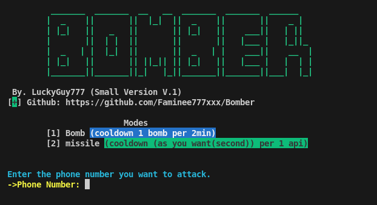

# Bomber
# Send OTP Script

สคริปต์สำหรับส่ง OTP ไปยังเบอร์โทรศัพท์มือถือเป้าหมายในไทย (เบอร์ไทย+66 เท่านั้น)

---

## ฟีเจอร์หลัก

- รองรับ **โหมด Bomb**: ส่ง OTP แบบครั้งเดียวไปทั้งหมดจำนวนมาก โดยระบุแค่เบอร์โทรเป้าหมาย
- รองรับ **โหมด Missile (มิชไชร์)**: ส่ง OTP แบบถี่ ๆ ตามจำนวนและเวลาที่กำหนด โดยระบุเบอร์เป้าหมาย, จำนวนครั้ง และเวลาหน่วงระหว่างส่ง (wait time)
- ใช้งานได้เฉพาะเบอร์โทรศัพท์มือถือในประเทศไทยเท่านั้น (รูปแบบหมายเลขไทย)

---

## วิธีใช้งาน
# 1. ติดตั้งไลบรารี่
```
pip install -r requirements.txt
```
# 2. รันโปรแกรม
```
python bomber.py
```
# 3. ระบุเบอร์ตัวอย่างเช่น
```
0654524894 มี 0 ข้างหน้า
```

# หมายเหตุ
>> โปรดใช้สคริปต์นี้อย่างรับผิดชอบ และไม่ใช้เพื่อก่อกวนหรือทำลายระบบของผู้อื่นโดยไม่ได้รับอนุญาต
ผู้พัฒนาไม่รับผิดชอบต่อความเสียหายที่เกิดขึ้นจากการใช้งานสคริปต์นี้

